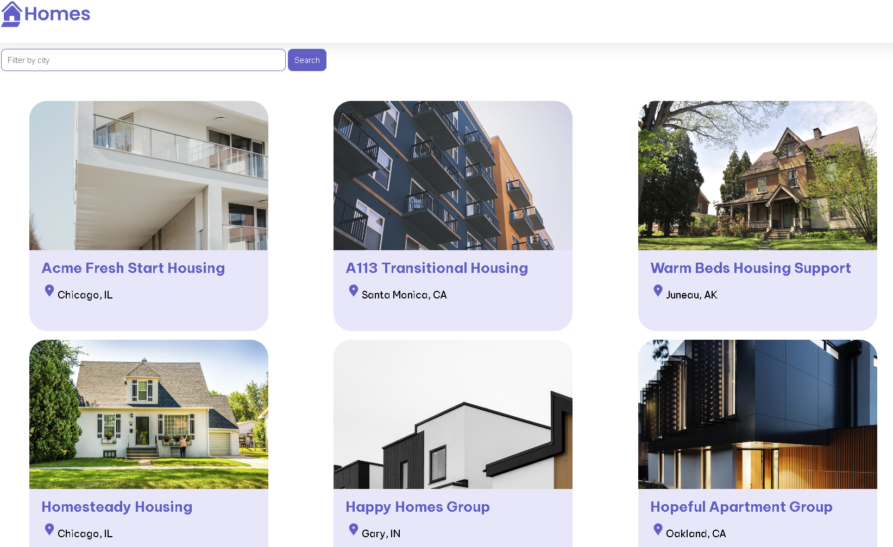

# Exercise 1: Running Angular App

Make sure GitHub Copilot is configure and enabled for the current language, just check the status bar on the bottom right corner of VS Code.

## Prepare and run Angular app

Ask Copilot Chat to explain the steps required to run Angular app. Follow the copilot steps and run this Home Gallary Angular app.

## Tips

With the previous exercises you have gone through some common activities that developers usually run:

- Create new features in the code
- Work with external APIs
- Create documentation
- Create tests

However, there are many other things that Copilot can helkp you with. Feel free to explore other slash command in the Copilot chat like:

- `/fix`: to fix the problems in your code
- `/explain`: for Copilot to explain you what the code does
