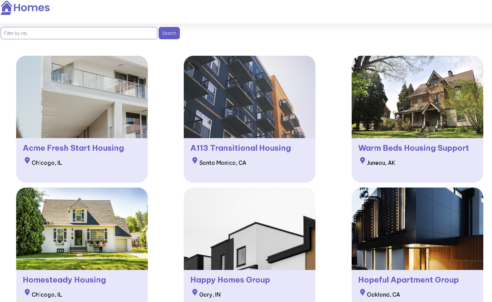

# Exercise 1: Running Angular App

## Setup

Confirm that `GitHub Copilot` is configured and enabled. Make sure you are logged in your GitHub account in your IDE (e.g. VS Code) or `Codespace`. Check the status bar on the bottom right corner of your IDE to verify Copilot is active.

## Prepare and Run Angular app

Assume you are new to Angular framework and do not know how to execute Angular project.
- Open Copilot Chat and use Ask Mode to type:

        `explain the steps required to run Angular app` 
 
- Review the instruction provided by copilot
- Follow these steps to run the `Home Gallery` Angular app.
- Once the Angular project is running, you should see the following web page in your browser.

## Tips for the lab exercise

Explore different features of GitHub Copilot.
Even if you already know how to write code using Angular, you can still ask questions and review the responses from Copilot. The more you use Copilot’s features, the more use cases you’ll discover to speed up your development work.

For the next a couple of lab exercises, we will

- Add new features to the code
- Work with external APIs
- Create documentation
- Write tests

There are many other things that Copilot can help you with. Feel free to explore command in the `Copilot chat` or `Drop down menus` such as:

- `/fix`: Fix the problems in your code
- `/explain`: Ask Copilot to explain what the code does

---------------
[Previous](./Readme.md) | [Next](./exercise-2.md)