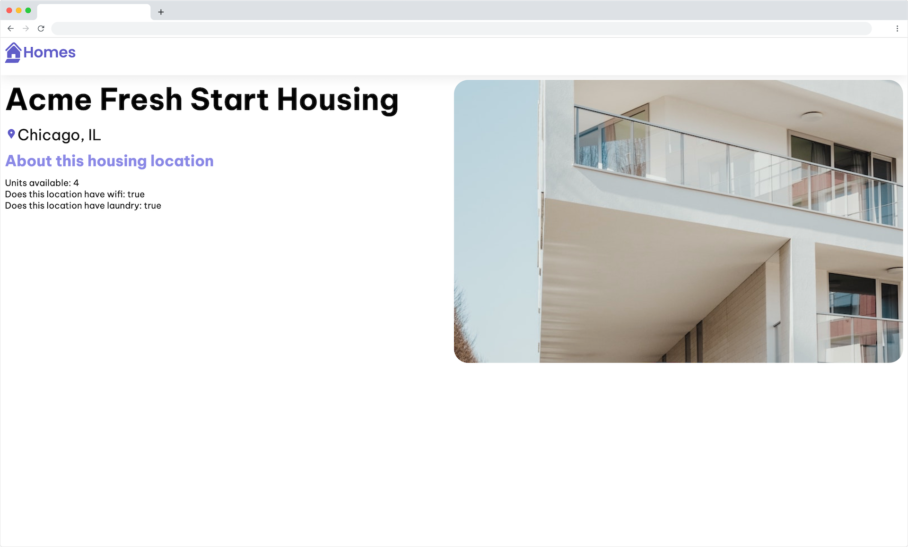

# Exercise 3: Integrate details page into application

Each housing location has specific details that should be displayed when a user navigates to the details page for that item. To accomplish this goal, you will need to use route parameters.

Route parameters enable you to include dynamic information as a part of your route URL. To identify which housing location a user has clicked on you will use the id property of the `HousingLocation` type.

## Using routerLink for dynamic navigation

We have added a second route to `src/app/routes.ts` which includes a special segment that identifies the route parameter, id:. In this case, :id is dynamic and will change based on how the route is requested by the code.

```
'details/:id'
```

Let's ask copilot to explain how the route parameter works in the `Copilot Chat`. Keep the `routes.ts` open and you can selected relevant lines and text blocks to be more targeted.

In `src/app/housing-location/housing-location.component.ts`, ask copilot to add an anchor tag to the section element and include the routerLink directive. You can use shortcut key to find up to 10 suggestions from copilot.

<details>
  <summary>Hint</summary>

```
// Add anchor with a routerLink directive to housing-location.component.ts
import {Component, Input} from '@angular/core';
import {CommonModule} from '@angular/common';
import {HousingLocation} from '../housinglocation';
import {RouterModule} from '@angular/router';
@Component({
  selector: 'app-housing-location',
  imports: [CommonModule, RouterModule],
  template: `
    <section class="listing">
      
      <h2 class="listing-heading">{{ housingLocation.name }}</h2>
      <p class="listing-location">{{ housingLocation.city }}, {{ housingLocation.state }}</p>
      <a [routerLink]="['/details', housingLocation.id]">Learn More</a>
    </section>
  `,
  styleUrls: ['./housing-location.component.css'],
})
export class HousingLocationComponent {
  @Input() housingLocation!: HousingLocation;
}
```

</details>

The `routerLink` directive enables Angular's router to create dynamic links in the application. The value assigned to the `routerLink` is an array with two entries: the static portion of the path and the dynamic data.

For the `routerLink` to work in the template, let's ask copilot to add a file level import of `RouterLink` and `RouterOutlet` from `@angular/router`, then update the component imports array to include both RouterLink and RouterOutlet.

At this point you can confirm that the routing is working in your app. In the browser, refresh the home page and click the `Learn More` button for a housing location.

## Get route parameters

In this step, you will get the route parameter in the `DetailsComponent`. Currently, the app displays `details works!`. Next you'll update the code to display the id value passed using the route parameters.

In `src/app/details/details.component.ts` update the template to import the functions, classes and services that you'll need to use in the DetailsComponent:

<details>
  <summary>Hint</summary>

```
// Update file level imports
import {Component, inject} from '@angular/core';
import {CommonModule} from '@angular/common';
import {ActivatedRoute} from '@angular/router';
import {HousingService} from '../housing.service';
import {HousingLocation} from '../housinglocation';
```

</details>

Add a comment `Update the template property of the @Component decorator to display the value housingLocationId.` above the code block, and press enter to trigger the code update from copilot.

<details>
  <summary>Hint</summary>

```
template: `<p>details works! {{ housingLocationId }}</p>`,
```

</details>

Add a comment inside `constructor()` function, the comment could be `read housingLocationId from this.route.snapshot.params['id'] parameter`:

<details>
  <summary>Hint</summary>

```
export class DetailsComponent {
         route: ActivatedRoute = inject(ActivatedRoute);
         housingLocationId = -1;
         constructor() {
             this.housingLocationId = Number(this.route.snapshot.params['id']);
         }
     }
```

</details>

This code gives the `DetailsComponent` access to the `ActivatedRoute` router feature that enables you to have access to the data about the current route. In the `constructor`, the code converts the `id` parameter acquired from the route from a string to a number.

Save all changes. In the browser, click on one of the housing location's `Learn More` links and confirm that the numeric value displayed on the page matches the id property for that location in the data.

## Customize the DetailComponent

Now that routing is working properly in the application this is a great time to update the template of the `DetailsComponent` to display the specific data represented by the housing location for the route parameter.

To access the data you will add a call to the `HousingService`.

We would like to create the template code similar to below layout. Give it a try see if you can describe the layout in natual language and let copilot to output html template.

<details>
  <summary>Hint</summary>

```
// Update the DetailsComponent template in src/app/details/details.component.ts

<article>
      
      <section class="listing-description">
        <h2 class="listing-heading">{{ housingLocation?.name }}</h2>
        <p class="listing-location">{{ housingLocation?.city }}, {{ housingLocation?.state }}</p>
      </section>
      <section class="listing-features">
        <h2 class="section-heading">About this housing location</h2>
        <ul>
          <li>Units available: {{ housingLocation?.availableUnits }}</li>
          <li>Does this location have wifi: {{ housingLocation?.wifi }}</li>
          <li>Does this location have laundry: {{ housingLocation?.laundry }}</li>
        </ul>
      </section>
    </article>
  `,
  styleUrls: ['./details.component.css'],

```

</details>

Notice that the `housingLocation` properties are being accessed with the optional chaining operator ?. This ensures that if the housingLocation value is null or undefined the application doesn't crash. Ask copilot to explain how `?` operator works and ask for an alternative way to implement it.

Now update the body of the `DetailsComponent` class to display the correct information based on the selected housing location. The constructor should include a call to the `HousingService` to pass the route parameter as an argument to the `getHousingLocationById` service function.

<details>
  <summary>Hint</summary>

```
// Update the DetailsComponent class in `src/app/details/details.component.ts`
route: ActivatedRoute = inject(ActivatedRoute);
  housingService = inject(HousingService);
  housingLocation: HousingLocation | undefined;

  constructor() {
    const housingLocationId = Number(this.route.snapshot.params['id']);
    this.housingLocation = this.housingService.getHousingLocationById(housingLocationId);
  }
```

</details>

Time to make the `DetailsComponent` looks prettier. Open `src/app/details/details.component.css` and ask copilot to create css style. Make sure you keep the `src/app/details/details.component.ts` file open too, this will give hint to copilot.

<details>
  <summary>Hint</summary>

```
// Add styles for the DetailsComponent
.listing-photo {
  height: 600px;
  width: 50%;
  object-fit: cover;
  border-radius: 30px;
  float: right;
}
.listing-heading {
  font-size: 48pt;
  font-weight: bold;
  margin-bottom: 15px;
}
.listing-location::before {
  content: url('/assets/location-pin.svg') / '';
}
.listing-location {
  font-size: 24pt;
  margin-bottom: 15px;
}
.listing-features > .section-heading {
  color: var(--secondary-color);
  font-size: 24pt;
  margin-bottom: 15px;
}
.listing-features {
  margin-bottom: 20px;
}
.listing-features li {
  font-size: 14pt;
}
li {
  list-style-type: none;
}
.listing-apply .section-heading {
  font-size: 18pt;
  margin-bottom: 15px;
}
label, input {
  display: block;
}
label {
  color: var(--secondary-color);
  font-weight: bold;
  text-transform: uppercase;
  font-size: 12pt;
}
input {
  font-size: 16pt;
  margin-bottom: 15px;
  padding: 10px;
  width: 400px;
  border-top: none;
  border-right: none;
  border-left: none;
  border-bottom: solid .3px;
}
@media (max-width: 1024px) {
  .listing-photo {
    width: 100%;
    height: 400px;
  }
}
```

</details>

In the browser refresh the page and confirm that when you click on the "Learn More" link for a given housing location the details page displays the correct information based on the data for that selected item.



## Add navigation to the HomeComponent

In a previous lesson you updated the `AppComponent` template to include a `routerLink`. Now add code to enable navigation back to the `HomeComponent` whenever the logo is clicked. Try to ask in the chat and see if copilot can locate the file for you.

<details>
  <summary>Hint</summary>

```
template: `
    <main>
      <a [routerLink]="['/']">
        <header class="brand-name">
          
        </header>
      </a>
      <section class="content">
        <router-outlet></router-outlet>
      </section>
    </main>
  `,
  styleUrls: ['./app.component.css'],
```

</details>

---------------
[Previous](./exercise-2.md) | [Next](./exercise-4.md)
