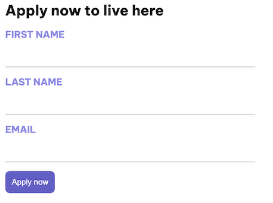

# Exercise 4: Adding a form to your Angular app

This lab will add a form that collects user data to an Angular app. The data that the form collects is sent only to the app's service, which writes it to the browser's console. Using a REST API to send and receive the form's data is not covered in this lesson.

## Add a method to send form data

This step adds a method to your app's service that receives the form data to send to the data's destination. In this example, the method writes the data from the form to the browser's console log.

Open `src/app/housing.service.ts`, inside the `HousingService` class, let's ask copilot to add a new function and it will logs the field names: `submitApplication(firstName: string, lastName: string, email: string)`. Only mention the fields you would like to add and see if copilot can produce the log string.

Confirm that the app builds without error. Correct any errors before you continue to the next step. You can use copilot `fix` option to resolve syntax errors.

<details>
  <summary>Hint - Possible Solution</summary>

```
// Submit method in src/app/housing.service.ts
submitApplication(firstName: string, lastName: string, email: string) {
    console.log(
      `Homes application received: firstName: ${firstName}, lastName: ${lastName}, email: ${email}.`,
    );
  }
```

</details>

## Add the form functions to the details page

This step adds the code to the details page that handles the form's interactions. Go to `src/app/details/details.component.ts`.

After the import statements at the top of the file, ask copilot to both import the Angular form classes and update the `imports` property for the `DetailsComponent` decorator metadata.

<details>
  <summary>Hint - Possible Solution</summary>

```
// imports directive in src/app/details/details.component.ts
import {Component, inject} from '@angular/core';
import {HousingService} from '../housing.service';
import {HousingLocation} from '../housinglocation';
import {CommonModule} from '@angular/common';
import {ActivatedRoute} from '@angular/router';
import {FormControl, FormGroup, ReactiveFormsModule} from '@angular/forms';

@Component({
  selector: 'app-details',
  imports: [CommonModule, ReactiveFormsModule],
  template: `....`,
  styleUrls: ['./details.component.css'],
})
```

</details>

Go to `DetailsComponent` class, before the `constructor()` method. In Angular, `FormGroup` and `FormControl` are types that enable you to build forms. The FormControl type can provide a default value and shape the form data. Let's create a new function `applyForm` using `FormGroup` and add `firstName`, `lastName`, `email` fields.

<details>
  <summary>Hint - Possible Solution</summary>

```
// template directive in src/app/details/details.component.ts
export class DetailsComponent {
  route: ActivatedRoute = inject(ActivatedRoute);
  housingService = inject(HousingService);
  housingLocation: HousingLocation | undefined;
  housingLocationId = -1;

  applyForm = new FormGroup({
    firstName: new FormControl(''),
    lastName: new FormControl(''),
    email: new FormControl(''),
  });
  
  constructor() {
    ....
  }

}
```

</details>

In the `DetailsComponent` class, create `submitApplication()` function after the `constructor()` method. Add code to handle the Apply now click, it should invoke `housing.service`'s `submitApplication`.. This button does not exist yet - you will add it in the next step. The FormControls may return null. The code should use the nullish coalescing operator to default to empty string if the value is null.

<details>
  <summary>Hint - Possible Solution</summary>

```
export class DetailsComponent {
  route: ActivatedRoute = inject(ActivatedRoute);
  housingService = inject(HousingService);
  housingLocation: HousingLocation | undefined;

  applyForm = new FormGroup({
    firstName: new FormControl(''),
    lastName: new FormControl(''),
    email: new FormControl(''),
  });
  
  constructor() {
    const housingLocationId = Number(this.route.snapshot.params['id']);
    this.housingLocation = this.housingService.getHousingLocationById(housingLocationId);
  }

  submitApplication() {
    this.housingService.submitApplication(
      this.applyForm.value.firstName ?? '',
      this.applyForm.value.lastName ?? '',
      this.applyForm.value.email ?? '',
    );
  }
}
```

</details>

Confirm that the app builds without error. Correct any errors before you continue to the next step.

## Add the form's markup to the details page

This step adds the markup to the details page that displays the form. Open `src/app/details/details.component.ts`.

In the `DetailsComponent` decorator metadata, ask copilot to add the `template` form HTML in the end of the page to have actual form and fields, it could look like below image.



The template should include an event handler `(submit)="submitApplication()"`. Angular uses parentheses syntax around the event name to define events in the template code. The code on the right hand side of the equals sign is the code that should be executed when this event is triggered. You can bind to browser events and custom events.

<details>
  <summary>Hint - Possible Solution</summary>
  
```
// template directive in src/app/details/details.component.ts
<article>
    ......
    <section class="listing-features">
      <h2 class="section-heading">About this housing location</h2>
      <ul>
        <li>Units available: {{ housingLocation?.availableUnits }}</li>
        <li>Does this location have wifi: {{ housingLocation?.wifi }}</li>
        <li>Does this location have laundry: {{ housingLocation?.laundry }}</li>
      </ul>
    </section>
    <section class="listing-apply">
      <h2 class="section-heading">Apply now to live here</h2>
      <form [formGroup]="applyForm" (submit)="submitApplication()">
        <label for="first-name">First Name</label>
        <input id="first-name" type="text" formControlName="firstName" />
        <label for="last-name">Last Name</label>
        <input id="last-name" type="text" formControlName="lastName" />
        <label for="email">Email</label>
        <input id="email" type="email" formControlName="email" />
        <button type="submit" class="primary">Apply now</button>
      </form>
    </section>
  </article>
`,
styleUrls: ['./details.component.css'],
```

</details>

Confirm that the app builds without error. Correct any errors before you continue to the next step.


## Test your app's new form

This step tests the new form to see that when the form data is submitted to the app, the form data appears in the console log.

- In the Terminal pane of your IDE, run ng serve, if it isn't already running.
- In your browser, open your app at http://localhost:4200.
- Right click on the app in the browser and from the context menu, choose Inspect.
- In the developer tools window, choose the Console tab. Make sure that the developer tools window is visible for the next steps
- In your app:
  * Select a housing location and click Learn more, to see details about the house.
  * In the house's details page, scroll to the bottom to find the new form.
  * Enter data into the form's fields - any data is fine.
  * Choose Apply now to submit the data.
- In the developer tools window, review the log output to find your form data.

---------------
[Previous](./exercise-3.md) | [Next](./exercise-5.md)
