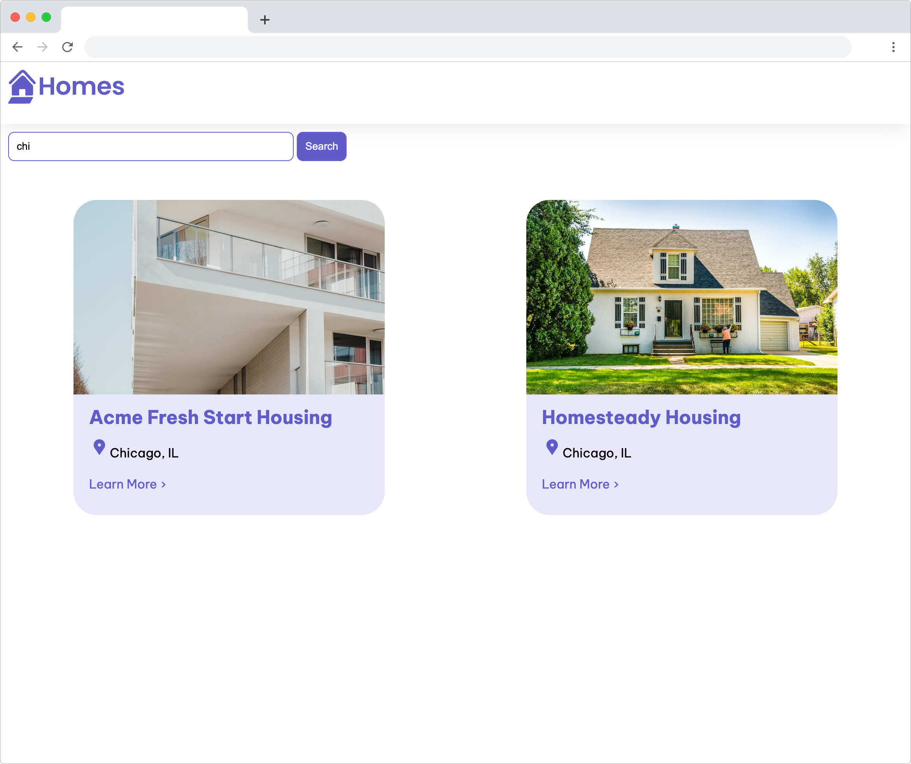

# Exercise 5: Add the search feature to your app

The app will enable users to search through the data provided by your app and display only the results that match the entered term.

## Update the home component properties

In this step, you'll update the `HomeComponent` class to store data in a new array property that you will use for filtering.

In `src/app/home/home.component.ts`, add new property to the class called `filteredLocationList`. The `filteredLocationList` should hold the values that match the search criteria entered by the user.

The `filteredLocationList` should contain the total set of housing locations values by default when the page loads. Update the constructor for the HomeComponent to set the value.

<details>
  <summary>Hint - Possible Solution</summary>

```
// Set the value of filteredLocationList

import {Component, inject} from '@angular/core';
import {CommonModule} from '@angular/common';
import {HousingLocationComponent} from '../housing-location/housing-location.component';
import {HousingLocation} from '../housinglocation';
import {HousingService} from '../housing.service';

@Component({
  selector: 'app-home',
  imports: [CommonModule, HousingLocationComponent],
  template: `....`,
  styleUrls: ['./home.component.css'],
})
export class HomeComponent {
  housingLocationList: HousingLocation[] = [];
  housingService: HousingService = inject(HousingService);
  filteredLocationList: HousingLocation[] = [];
  constructor() {
    this.housingLocationList = this.housingService.getAllHousingLocations();
    this.filteredLocationList = this.housingLocationList;
  }
  filterResults(text: string) {
    // todo
  }
}
```

</details>

## Update the home component template

The `HomeComponent` already contains an input field that you will use to capture input from the user. That string text will be used to filter the results.

Update the `HomeComponent` template to include a template variable in the `input` element called `#filter`. It should use a template reference variable to get access to the input element as its value.

<details>
  <summary>Hint - Possible Solution</summary>

```
// Add a template variable to HomeComponent's template
<input type="text" placeholder="Filter by city" #filter>
```

</details>

Next, update the component template to attach an event handler to the `Search` button. 

Bind the `click` event on the `button` element, you are able to call the `filterResults` function. The argument to the function is the `value` property of the `filter` template variable. Specifically, the `.value` property from the `input` HTML element.

<details>
  <summary>Hint - Possible Solution</summary>

```
// Bind the click event
<button class="primary" type="button" (click)="filterResults(filter.value)">Search</button>
```

</details>


The last template update is to the `ngFor` directive. Update the `ngFor` value to iterate over values from the `filteredLocationList` array.

<details>
  <summary>Hint - Possible Solution</summary>

```
// Update the ngFor directive value
<app-housing-location *ngFor="let housingLocation of filteredLocationList" [housingLocation]="housingLocation"></app-housing-location>
```

</details>


## Implement the event handler function

The template has been updated to bind the `filterResults` function to the click event. Next, your task is to implement the `filterResults` function in the `HomeComponent` class.

Update the `HomeComponent` class to include the implementation of the `filterResults` function. The function should use the String filter function to compare the value of the text parameter against the `housingLocation.city` property. You can update this function to match against any property or multiple properties for a fun exercise.

<details>
  <summary>Hint - Possible Solution</summary>

```
// Add the filterResults function implementation
import {Component, inject} from '@angular/core';
import {CommonModule} from '@angular/common';
import {HousingLocationComponent} from '../housing-location/housing-location.component';
import {HousingLocation} from '../housinglocation';
import {HousingService} from '../housing.service';
@Component({
  selector: 'app-home',
  imports: [CommonModule, HousingLocationComponent],
  template: `
    <section>
      <form>
        <input type="text" placeholder="Filter by city" #filter />
        <button class="primary" type="button" (click)="filterResults(filter.value)">Search</button>
      </form>
    </section>
    <section class="results">
      <app-housing-location
        *ngFor="let housingLocation of filteredLocationList"
        [housingLocation]="housingLocation"
      ></app-housing-location>
    </section>
  `,
  styleUrls: ['./home.component.css'],
})
export class HomeComponent {
  housingLocationList: HousingLocation[] = [];
  housingService: HousingService = inject(HousingService);
  filteredLocationList: HousingLocation[] = [];
  constructor() {
    this.housingLocationList = this.housingService.getAllHousingLocations();
    this.filteredLocationList = this.housingLocationList;
  }
  filterResults(text: string) {
    if (!text) {
      this.filteredLocationList = this.housingLocationList;
      return;
    }
    this.filteredLocationList = this.housingLocationList.filter((housingLocation) =>
      housingLocation?.city.toLowerCase().includes(text.toLowerCase()),
    );
  }
}
```

</details>

Save your code. Refresh the browser and confirm that you can search the housing location data by city when you click the "Search" button after entering text.




---------------
[Previous](./exercise-4.md) | [Next](./exercise-6.md)