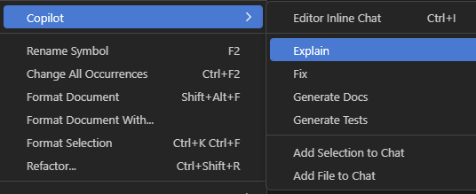
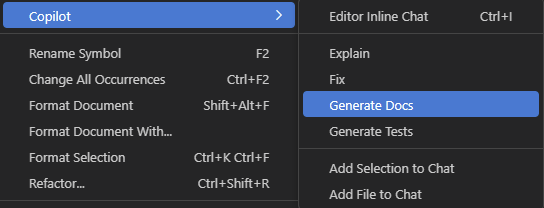

# Excercise 9: Document the code

Documenting code is always a boring and painful task. The good news is that we can use Copilot to document it for us. 

In this lab, we will learn how to document the codebase using Copilot. We will also explore how Copilot can assist in understanding the codebase, which is particularly helpful when working with unfamiliar code.

## Understand the Codebase

Use the `@workspace` context to gain insights into the codebase. You can ask Copilot to explain classes, methods, or variables.

Let's start with any `.ts` files. You can ask Copilot to explain the file and its methods.

```text
@workspace /explain app.component.ts class
```

When dealing with unfamiliar code, you can use the `Explain` feature to better understand the codebase. Select the code snippet you want to understand and invoke the `Explain` feature.



You can also ask Copilot to explain the entire project codebase.

```text
@workspace /explain the project codebase
```

## Add Documentation

Add documentation to the class and its methods. The `Generate Docs` feature helps you create documentation comments for classes, methods, and properties.



You can also generate documentation for the entire project. Try using the following command:

```text
@workspace Generate Readme file for the project
```

Copilot is an great tool for working with markdown files. It can provide inline suggestions to help you generate comprehensive documentation effortlessly.

